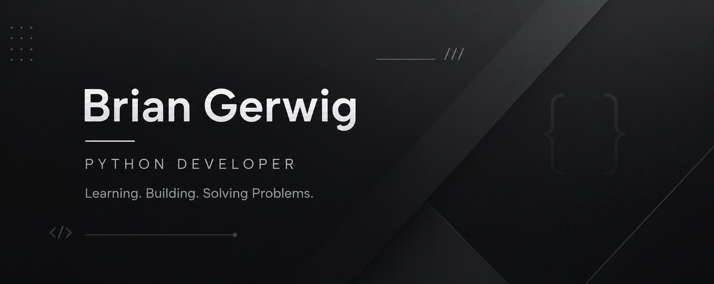

  

# Hi, I'm Brian Gerwig 👋

### Automotive Technician → Future Software Developer

Welcome to my GitHub!

I'm currently transitioning from automotive diagnostics into software development. After spending years troubleshooting complex mechanical and electrical systems, I discovered that I enjoy solving software problems just as much.

I'm focused on learning Python, automation, AI, and software engineering while building real-world projects that solve practical problems.

My goal is to combine my technical background with modern software development to build useful applications and eventually work as a remote software developer.

---

## 🚀 What I'm Learning

- 🐍 Python
- 🌿 Git & GitHub
- 🤖 AI & APIs
- 🗄 SQL
- 🌐 Flask
- 💻 Software Development

---

## 🛠 Projects I'm Building

🚗 Brian's Detail Pricing Engine

📅 Appointment Scheduler

📄 Invoice Generator

🤖 AI Customer Assistant

📊 Expense Tracker

*(More projects coming soon!)*

---

## 🎯 Current Goals

- Build professional software projects
- Strengthen my Python skills
- Learn modern development tools
- Contribute to open-source projects
- Land my first remote software engineering role

---

## 💡 A Little About Me

Outside of coding you'll usually find me working on vehicles, detailing cars, spending time with my dogs, gaming, or learning something new.

I enjoy solving problems—whether they're under the hood or in code.

---

## 📫 Let's Connect

- 💼 LinkedIn: [https://www.linkedin.com/in/charles-gerwig-88584519a/](https://www.linkedin.com/in/charles-gerwig-88584519a/)
## 📈 Current Focus

- Building practical Python projects
- Learning Git, GitHub, and software development workflows
- Exploring AI, APIs, automation, and SQL
- Turning real automotive and business problems into software solutions
